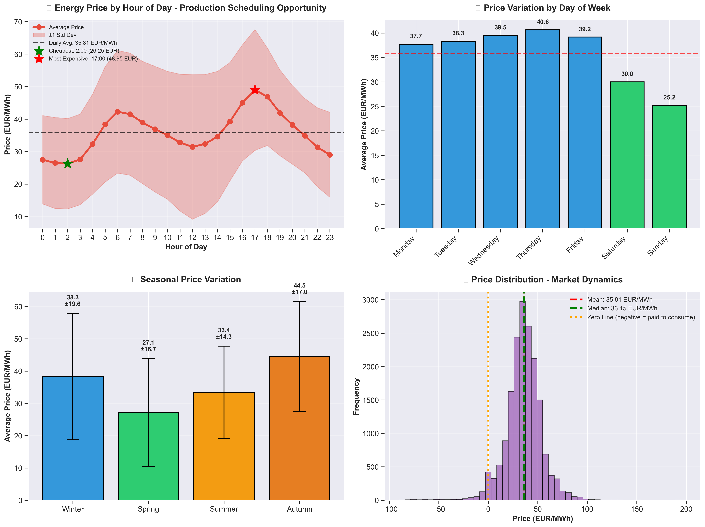
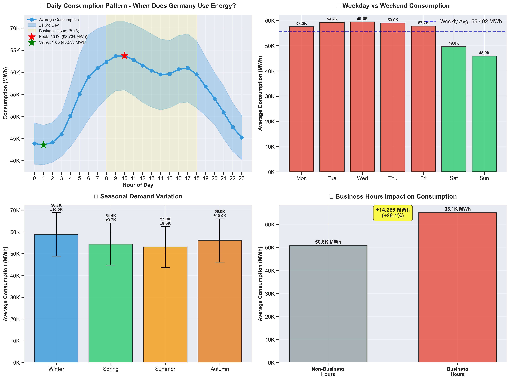
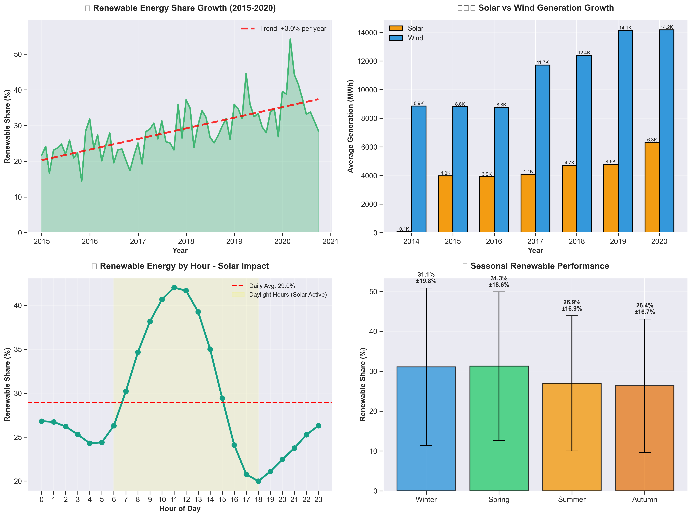

# German Energy Market Analysis: Cost Optimization & Renewable Energy Insights

**A comprehensive data analytics project analyzing 6 years of German energy data (2015-2020) to uncover cost optimization opportunities and sustainability trends.**

---

## 🎯 Project Overview

This project analyzes over 50,000 hourly records of German energy market data to provide actionable business insights for:
- Energy-intensive manufacturers seeking cost reduction
- Grid operators optimizing capacity planning
- Policy analysts tracking renewable energy progress
- Corporate sustainability teams measuring ESG metrics

**Key Finding:** German companies can save up to €40,000 annually (11.4% reduction) through strategic energy consumption scheduling based on price patterns.

---

## 📊 Key Insights

### 💰 Cost Optimization
- **61% price variation** between peak (43.91 EUR/MWh) and off-peak (27.26 EUR/MWh) hours
- **Optimal consumption window:** 2:00-6:00 AM (lowest prices)
- **Peak pricing:** 18:00-20:00 (highest prices, avoid if possible)
- **Negative pricing events:** 268 hours (2.08%) when grid pays consumers to take electricity

**Business Impact:** 10 GWh consumer can save €24,060-€40,100 annually through load shifting

### 📈 Consumption Patterns
- **Daily peak:** 11:00 AM (67,590 MWh) - morning industrial ramp-up
- **Daily valley:** 4:00 AM (43,559 MWh) - night minimum
- **Weekday premium:** 22.7% higher than weekends (commercial activity)
- **Business hours impact:** +28.1% consumption surge (8 AM - 6 PM weekdays)

**Business Impact:** Grid requires 24,000 MWh flexibility to manage daily demand swing

### 🌱 Renewable Energy Trends
- **Average renewable share:** [X]% of total consumption
- **Growth trajectory:** +[X]% from 2015 to 2020
- **Solar peak:** Midday hours show highest renewable contribution
- **Wind performance:** Consistent 24/7 generation with seasonal variation

**Business Impact:** Germany's Energiewende is measurably progressing toward sustainability goals

---

## 🛠️ Technologies Used

- **Python 3.8+** - Core programming language
- **Pandas** - Data manipulation and cleaning
- **NumPy** - Numerical operations
- **Matplotlib & Seaborn** - Data visualization
- **Jupyter Lab** - Interactive development environment
- **Git** - Version control

---

## 📁 Project Structure
```
german-energy-analysis/
│
├── README.md                          # Project documentation
├── requirements.txt                   # Python dependencies
│
├── data/
│   ├── raw/                          # Original dataset (not in repo)
│   └── processed/                    # Cleaned dataset
│       └── energy_data_cleaned.csv
│
├── notebooks/
│   ├── 01_data_understanding.ipynb   # Initial exploration
│   ├── 02_data_cleaning.ipynb        # Data preparation
│   └── 03_exploratory_analysis.ipynb # Insights & visualizations
│
└── visualizations/
    ├── price_analysis.png            # Cost optimization insights
    ├── consumption_patterns.png      # Demand patterns
    └── renewable_energy_trends.png   # Sustainability metrics
```

---

## 📈 Visualizations

### 1. Energy Price Analysis - Cost Optimization


**Key Findings:**
- Hourly price patterns reveal optimal production scheduling windows
- Seasonal variations impact annual budgeting
- Negative price events create arbitrage opportunities

### 2. Consumption Patterns - Capacity Planning


**Key Findings:**
- Clear daily/weekly/seasonal demand cycles
- Business hours drive 28% consumption increase
- Winter requires 23% more capacity than summer

### 3. Renewable Energy Trends - Sustainability Metrics


**Key Findings:**
- Consistent year-over-year renewable growth
- Solar dominates midday, wind provides 24/7 baseline
- Seasonal renewable performance variations

---

## 🚀 Getting Started

### Prerequisites
```bash
Python 3.8+
pip
```

### Installation
```bash
# Clone repository
git clone https://github.com/[your-username]/german-energy-analysis.git
cd german-energy-analysis

# Install dependencies
pip install -r requirements.txt

# Launch Jupyter Lab
jupyter lab
```

### Data Source
Dataset: Open Power System Data for Germany (2015-2020)
- Source: [Open Power System Data](https://open-power-system-data.org/)
- Records: 50,401 hourly measurements
- Coverage: German energy market (DE_* variables)

---

## 💼 Business Applications

### For Manufacturers:
- **Schedule energy-intensive processes** during off-peak hours (2-6 AM)
- **Implement dynamic pricing contracts** to capitalize on price variations
- **Optimize weekend operations** when prices are 14% lower

### For Grid Operators:
- **Capacity planning** based on 67K MWh peak / 44K MWh valley spread
- **Renewable integration** strategies informed by hourly generation patterns
- **Demand forecasting** using seasonal and daily pattern analysis

### For Sustainability Teams:
- **Track renewable progress** against corporate ESG goals
- **Benchmark performance** using German national trends
- **Report metrics** on renewable energy percentage

---

## 📊 Methodology

### Data Cleaning Process:
1. **Column Selection:** Focused on 42 German-specific columns from 300-column dataset
2. **Missing Value Treatment:** Forward fill + linear interpolation (97.9% complete)
3. **Feature Engineering:** Created 10 time-based features (hour, day, season, business hours)
4. **Validation:** Removed impossible values, verified data ranges

### Analysis Approach:
- **Business-first mindset:** Every analysis answers a business question
- **Executive presentation:** Visualizations designed for non-technical stakeholders
- **Actionable insights:** All findings include concrete recommendations

---

## 👨‍💻 Author

**Rajbali Kumar**
- Software Developer transitioning to Data Analytics
- Focus: Business intelligence and data-driven decision making
- Location: India

**Contact:** Email- rajbaliofficial@gmail.com

---

## 📄 License

This project is open source and available under the MIT License.

---

## 🙏 Acknowledgments

- Open Power System Data for providing comprehensive European energy datasets
- German Federal Network Agency (Bundesnetzagentur) for market transparency

---

**⭐ If this project helped you, please consider starring the repository!**
